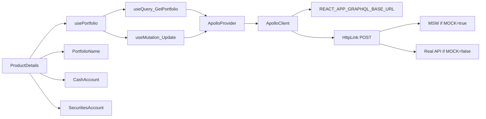

# GraphQL API Client — Step-by-step tutorial (Apollo Client)

> You implement this by hand. Each task is one vertical slice: write the files (or the failing test first), run the command, confirm the expected output, then continue. Checkboxes are for you.

This version uses **Apollo Client 3**, not Axios. GraphQL-over-HTTP is still a POST to `REACT_APP_GRAPHQL_BASE_URL`; Apollo owns the cache, `gql` documents, `useQuery`, and `useMutation`. MSW still pretends to be the API.

If you already created `.env` / `.env.example` from the Axios draft, keep them. Do not build an Axios helper.

**Goal:** The product-details page loads with `GetPortfolio` and saves a rename with `UpdatePortfolioPersonalization` through Apollo. Until the real API exists, MSW intercepts the same URL.

**Architecture:** `createApolloClient()` builds an `ApolloClient` whose `HttpLink` URI comes from `.env`. `ApolloProvider` wraps the tree. `usePortfolio` is the only UI entry point (`useQuery` + `useMutation`). `ProductDetails` passes props into `PortfolioName`, `CashAccount`, and `SecuritiesAccount`. When `REACT_APP_GRAPHQL_MOCK=true`, MSW serves responses that match [src/schema.graphql](src/schema.graphql).

**Tech stack:** Create React App (`react-scripts` 5), React 18, TypeScript 4.3, `@apollo/client@3.11.10`, `graphql@16.9.0`, MSW 2.x. Pin Apollo 3 — Apollo 4 changes imports (`@apollo/client/react`) and wants a newer TypeScript than this repo has.

## Global Constraints

- Env vars **must** be prefixed with `REACT_APP_` or CRA will ignore them.
- Base URL: `http://localhost:4000/graphql`
- Use Apollo Client 3 (`import { ... } from "@apollo/client"`). Do not add Axios GraphQL helpers, urql, or graphql-codegen.
- Keep portfolio id `oCt4GtuDS2YjimboYTBfNu` and the current hardcoded IBAN/BIC/name as MSW seed data.
- MSW responses **must** include `__typename` on every object. Apollo's `InMemoryCache` normalizes by `__typename` + `id`.
- Restart `npm start` after every `.env` change.
- Do not commit `.env` / `.env.local`. Do commit `.env.example` and `.env.test`.
- Commits are optional.

## How to use this tutorial

1. Do the tasks in order. Later tasks import names from earlier ones.
2. Type (or paste) the **full file** shown in each create/replace step.
3. After each **Run** step, do not continue unless the output matches.
4. Tests: from the repo root. Use `CI=true` so Jest is not watch-mode.

## Target file map

```text
.env.example                         # committed documentation of env vars
.env.test                            # loaded automatically by `npm test`
.env                                 # you create locally; not committed
src/react-app-env.d.ts               # TypeScript types for the env vars
src/graphql/types.ts                 # types mirroring schema.graphql
src/graphql/operations.ts            # gql GetPortfolio + UpdatePortfolioPersonalization
src/graphql/constants.ts             # PORTFOLIO_ID
src/graphql/client.ts                # createApolloClient()
src/graphql/client.test.ts
src/graphql/test-utils.tsx           # renderWithApollo for tests
src/mocks/data.ts                    # in-memory portfolio store + __typename
src/mocks/handlers.ts                # MSW GraphQL handlers
src/mocks/browser.ts
src/mocks/server.ts
src/setupTests.ts                    # whatwg-fetch + MSW server
src/product-details/hooks/use-portfolio.ts
src/product-details/hooks/use-portfolio.test.tsx
public/mockServiceWorker.js          # generated by `npx msw init`
src/index.tsx                        # MSW then ApolloProvider
src/product-details/page.tsx
src/product-details/tests/page.test.tsx
```



---

### Task 1: Environment variables

**Why:** CRA inlines `process.env.REACT_APP_*` at build time. Apollo's `HttpLink`, MSW `graphql.link()`, and tests must share one URL. `.env.test` exists so Jest does not depend on your private `.env`.

**Files:**
- Create: `.env.example`
- Create: `.env.test`
- Create: `.env` (local only)
- Modify: `.gitignore`
- Modify: `src/react-app-env.d.ts`

**Interfaces:**
- Consumes: nothing
- Produces: `process.env.REACT_APP_GRAPHQL_BASE_URL` and `process.env.REACT_APP_GRAPHQL_MOCK`

- [ ] **Step 1: Create `.env.example`**

Skip if this file already exists with these two lines.

```env
REACT_APP_GRAPHQL_BASE_URL=http://localhost:4000/graphql
REACT_APP_GRAPHQL_MOCK=true
```

- [ ] **Step 2: Create `.env.test`** (same contents)

CRA loads this file automatically when you run `npm test`.

```env
REACT_APP_GRAPHQL_BASE_URL=http://localhost:4000/graphql
REACT_APP_GRAPHQL_MOCK=true
```

- [ ] **Step 3: Create your local `.env`**

```env
REACT_APP_GRAPHQL_BASE_URL=http://localhost:4000/graphql
REACT_APP_GRAPHQL_MOCK=true
```

When the real API exists: put the real URL here, set `REACT_APP_GRAPHQL_MOCK=false`, restart `npm start`.

- [ ] **Step 4: Ignore `.env` in git**

In `.gitignore`, under `# misc`, add `.env`:

```gitignore
# misc
.DS_Store
.env
.env.local
.env.development.local
.env.test.local
.env.production.local
```

Do **not** ignore `.env.example` or `.env.test`.

- [ ] **Step 5: Type the env vars**

Replace `src/react-app-env.d.ts` with:

```typescript
/// <reference types="react-scripts" />

declare namespace NodeJS {
  interface ProcessEnv {
    REACT_APP_GRAPHQL_BASE_URL?: string;
    REACT_APP_GRAPHQL_MOCK?: string;
  }
}

declare module "*.css";
```

- [ ] **Step 6: Confirm the files exist**

You cannot `echo $REACT_APP_GRAPHQL_BASE_URL` in the shell and see CRA's value. Confirmation is: the three env files exist and `.gitignore` lists `.env`.

Optional checkpoint:

```bash
git add .env.example .env.test .gitignore src/react-app-env.d.ts
git commit -m "chore: add GraphQL env templates"
```

---

### Task 2: Apollo Client factory, types, and `gql` operations

**Why:** `src/schema.graphql` is the contract. `gql` documents are what Apollo sends and what MSW matches by **operation name** (`GetPortfolio`, `UpdatePortfolioPersonalization`). A factory (not a singleton module export used in tests) lets each test get a fresh `InMemoryCache`.

**Files:**
- Create: `src/graphql/types.ts`
- Create: `src/graphql/operations.ts`
- Create: `src/graphql/constants.ts`
- Create: `src/graphql/client.ts`
- Test: `src/graphql/client.test.ts`

**Interfaces:**
- Consumes: `process.env.REACT_APP_GRAPHQL_BASE_URL`
- Produces:
  - `createApolloClient(): ApolloClient<NormalizedCacheObject>`
  - `GET_PORTFOLIO`, `UPDATE_PORTFOLIO_PERSONALIZATION` (`DocumentNode`)
  - `PORTFOLIO_ID = "oCt4GtuDS2YjimboYTBfNu"`

- [ ] **Step 1: Install Apollo Client 3 and `graphql`**

```bash
npm install @apollo/client@3.11.10 graphql@16.9.0
```

Expected: both packages in `dependencies`. Do not install `@apollo/client@4`.

- [ ] **Step 2: Write the failing client test**

Create `src/graphql/client.test.ts`:

```typescript
import { ApolloClient } from "@apollo/client";
import { createApolloClient } from "./client";

describe("createApolloClient", () => {
  it("returns an ApolloClient", () => {
    expect(createApolloClient()).toBeInstanceOf(ApolloClient);
  });

  it("throws when REACT_APP_GRAPHQL_BASE_URL is missing", () => {
    const original = process.env.REACT_APP_GRAPHQL_BASE_URL;
    delete process.env.REACT_APP_GRAPHQL_BASE_URL;

    expect(() => createApolloClient()).toThrow(
      "REACT_APP_GRAPHQL_BASE_URL is not set"
    );

    process.env.REACT_APP_GRAPHQL_BASE_URL = original;
  });
});
```

- [ ] **Step 3: Run the test and confirm it fails**

```bash
CI=true npx react-scripts test src/graphql/client.test.ts --watchAll=false
```

Expected: FAIL, module `./client` not found.

- [ ] **Step 4: Add types mirroring `src/schema.graphql`**

Create `src/graphql/types.ts`:

```typescript
export type PortfolioPersonalizationErrorField = "PORTFOLIO_ID" | "NAME";

export interface CashAccount {
  __typename?: "CashAccount";
  iban: string | null;
  bic: string | null;
}

export interface PostOnboardingInfo {
  __typename?: "PostOnboardingInfo";
  id: string;
  allStepsCompleted: boolean;
}

export interface ProductPersonalization {
  __typename?: "ProductPersonalization";
  id: string;
  name: string;
}

export interface Portfolio {
  __typename?: "Portfolio";
  id: string;
  cashAccount: CashAccount | null;
  postOnboardingInfo: PostOnboardingInfo;
  securitiesAccountNumber: string | null;
  custodianBankBIC: string | null;
  personalizations: ProductPersonalization | null;
}

export interface PortfolioPersonalizationError {
  __typename?: "PortfolioPersonalizationError";
  field: PortfolioPersonalizationErrorField;
  message: string;
}

export interface GetPortfolioData {
  portfolio: Portfolio | null;
}

export interface GetPortfolioVariables {
  portfolioId: string;
}

export interface UpdatePortfolioPersonalizationInput {
  portfolioId: string;
  name: string;
}

export interface UpdatePortfolioPersonalizationPayload {
  __typename?: "UpdatePortfolioPersonalizationPayload";
  portfolio: Portfolio | null;
  errors: PortfolioPersonalizationError[];
}

export interface UpdatePortfolioPersonalizationData {
  updatePortfolioPersonalization: UpdatePortfolioPersonalizationPayload | null;
}

export interface UpdatePortfolioPersonalizationVariables {
  input: UpdatePortfolioPersonalizationInput;
}
```

`__typename` is optional on the TS side and **required** on MSW payloads later.

- [ ] **Step 5: Add the `gql` documents and portfolio id**

Create `src/graphql/constants.ts`:

```typescript
export const PORTFOLIO_ID = "oCt4GtuDS2YjimboYTBfNu";
```

Create `src/graphql/operations.ts`:

```typescript
import { gql } from "@apollo/client";

export const GET_PORTFOLIO = gql`
  query GetPortfolio($portfolioId: ID!) {
    portfolio(portfolioId: $portfolioId) {
      id
      cashAccount {
        iban
        bic
      }
      postOnboardingInfo {
        id
        allStepsCompleted
      }
      securitiesAccountNumber
      custodianBankBIC
      personalizations {
        id
        name
      }
    }
  }
`;

export const UPDATE_PORTFOLIO_PERSONALIZATION = gql`
  mutation UpdatePortfolioPersonalization($input: UpdatePortfolioPersonalizationInput!) {
    updatePortfolioPersonalization(input: $input) {
      portfolio {
        id
        personalizations {
          id
          name
        }
      }
      errors {
        field
        message
      }
    }
  }
`;
```

The operation names `GetPortfolio` and `UpdatePortfolioPersonalization` must stay exactly like this — MSW matches them. Apollo adds `__typename` to the request automatically; you do not write it in the document.

- [ ] **Step 6: Implement `createApolloClient`**

Create `src/graphql/client.ts`:

```typescript
import { ApolloClient, HttpLink, InMemoryCache } from "@apollo/client";

export function createApolloClient() {
  const uri = process.env.REACT_APP_GRAPHQL_BASE_URL;

  if (!uri) {
    throw new Error("REACT_APP_GRAPHQL_BASE_URL is not set");
  }

  return new ApolloClient({
    link: new HttpLink({ uri }),
    cache: new InMemoryCache(),
  });
}
```

Always call the factory. Do not export a shared `client` singleton — tests need a new cache per case.

- [ ] **Step 7: Re-run the client test**

```bash
CI=true npx react-scripts test src/graphql/client.test.ts --watchAll=false
```

Expected: PASS (2 tests).

If the "missing URL" test fails because CRA inlined the value, keep the `throw` in `client.ts` and drop that one assertion.

Optional checkpoint:

```bash
git add package.json package-lock.json src/graphql
git commit -m "feat: add Apollo Client factory"
```

---

### Task 3: MSW mock layer

**Why:** The backend is not ready. MSW intercepts POSTs to `http://localhost:4000/graphql` in the browser (service worker) and in Jest (`setupServer`). An in-memory store makes a rename persist for later `GetPortfolio` calls in the same session.

Apollo's `HttpLink` uses **`fetch`**. Jest's jsdom does not provide `fetch`, so `setupTests.ts` must polyfill it **before** MSW starts. Axios hid this because it uses XHR.

**Files:**
- Create: `src/mocks/data.ts`
- Create: `src/mocks/handlers.ts`
- Create: `src/mocks/browser.ts`
- Create: `src/mocks/server.ts`
- Create: `src/setupTests.ts`
- Create: `public/mockServiceWorker.js` (generated)
- Test: `src/mocks/handlers.test.ts`

**Interfaces:**
- Consumes: `GET_PORTFOLIO`, `UPDATE_PORTFOLIO_PERSONALIZATION`, `createApolloClient`, `PORTFOLIO_ID`
- Produces: `handlers`, `worker`, `server`, `getPortfolio()`, `resetPortfolio()`, `updatePortfolioName(name: string)`

- [ ] **Step 1: Install MSW and generate the service worker**

```bash
npm install msw@2.7.5 --save-dev
npx msw init public/ --save
```

Expected: `public/mockServiceWorker.js` exists. `package.json` gains `msw.workerDirectory` of `public`.

- [ ] **Step 2: Write the failing handlers test**

This test talks to GraphQL **through Apollo** (`client.query` / `client.mutate`), not through a raw POST helper.

Create `src/mocks/handlers.test.ts`:

```typescript
import { createApolloClient } from "../graphql/client";
import { PORTFOLIO_ID } from "../graphql/constants";
import {
  GET_PORTFOLIO,
  UPDATE_PORTFOLIO_PERSONALIZATION,
} from "../graphql/operations";
import {
  GetPortfolioData,
  GetPortfolioVariables,
  UpdatePortfolioPersonalizationData,
  UpdatePortfolioPersonalizationVariables,
} from "../graphql/types";
import { resetPortfolio } from "./data";

describe("GraphQL MSW handlers", () => {
  beforeEach(() => {
    resetPortfolio();
  });

  it("returns the seeded portfolio for GetPortfolio", async () => {
    const client = createApolloClient();
    const result = await client.query<GetPortfolioData, GetPortfolioVariables>({
      query: GET_PORTFOLIO,
      variables: { portfolioId: PORTFOLIO_ID },
      fetchPolicy: "network-only",
    });

    expect(result.error).toBeUndefined();
    expect(result.data.portfolio).toMatchObject({
      id: PORTFOLIO_ID,
      personalizations: { name: "Broker Portfolio" },
      cashAccount: {
        iban: "DE89370400440532013000",
        bic: "COBADEFFXXX",
      },
      securitiesAccountNumber: "5134823356",
      custodianBankBIC: "SCABDEMMXXX",
    });
  });

  it("returns PORTFOLIO_ID error for an unknown id on mutate", async () => {
    const client = createApolloClient();
    const result = await client.mutate<
      UpdatePortfolioPersonalizationData,
      UpdatePortfolioPersonalizationVariables
    >({
      mutation: UPDATE_PORTFOLIO_PERSONALIZATION,
      variables: { input: { portfolioId: "unknown", name: "Growth Portfolio" } },
    });

    expect(result.data?.updatePortfolioPersonalization).toEqual({
      __typename: "UpdatePortfolioPersonalizationPayload",
      portfolio: null,
      errors: [
        {
          __typename: "PortfolioPersonalizationError",
          field: "PORTFOLIO_ID",
          message: "Portfolio not found",
        },
      ],
    });
  });

  it("updates the stored name and returns it on later GetPortfolio", async () => {
    const client = createApolloClient();

    const mutateResult = await client.mutate<
      UpdatePortfolioPersonalizationData,
      UpdatePortfolioPersonalizationVariables
    >({
      mutation: UPDATE_PORTFOLIO_PERSONALIZATION,
      variables: { input: { portfolioId: PORTFOLIO_ID, name: "Growth Portfolio" } },
    });

    expect(mutateResult.data?.updatePortfolioPersonalization?.errors).toEqual([]);
    expect(
      mutateResult.data?.updatePortfolioPersonalization?.portfolio?.personalizations
        ?.name
    ).toBe("Growth Portfolio");

    const queryResult = await client.query<GetPortfolioData, GetPortfolioVariables>({
      query: GET_PORTFOLIO,
      variables: { portfolioId: PORTFOLIO_ID },
      fetchPolicy: "network-only",
    });

    expect(queryResult.data.portfolio?.personalizations?.name).toBe(
      "Growth Portfolio"
    );
  });
});
```

`fetchPolicy: "network-only"` skips a warm cache so the assertion hits MSW.

- [ ] **Step 3: Run it — it must fail** (no MSW, so `HttpLink` cannot reach localhost:4000)

```bash
CI=true npx react-scripts test src/mocks/handlers.test.ts --watchAll=false
```

Expected: FAIL with a network error (`Failed to fetch` / `ECONNREFUSED`). Do not add handlers yet if this did not fail.

- [ ] **Step 4: Seed data store**

Create `src/mocks/data.ts`:

```typescript
import { PORTFOLIO_ID } from "../graphql/constants";
import { Portfolio } from "../graphql/types";

const seedPortfolio = (): Portfolio => ({
  __typename: "Portfolio",
  id: PORTFOLIO_ID,
  cashAccount: {
    __typename: "CashAccount",
    iban: "DE89370400440532013000",
    bic: "COBADEFFXXX",
  },
  postOnboardingInfo: {
    __typename: "PostOnboardingInfo",
    id: `PostOnboardingInfo-${PORTFOLIO_ID}`,
    allStepsCompleted: true,
  },
  securitiesAccountNumber: "5134823356",
  custodianBankBIC: "SCABDEMMXXX",
  personalizations: {
    __typename: "ProductPersonalization",
    id: `ProductPersonalization-${PORTFOLIO_ID}`,
    name: "Broker Portfolio",
  },
});

let portfolio: Portfolio = seedPortfolio();

export function getPortfolio(): Portfolio {
  return portfolio;
}

export function resetPortfolio(): void {
  portfolio = seedPortfolio();
}

export function updatePortfolioName(name: string): Portfolio {
  if (!portfolio.personalizations) {
    portfolio.personalizations = {
      __typename: "ProductPersonalization",
      id: `ProductPersonalization-${portfolio.id}`,
      name,
    };
  } else {
    portfolio.personalizations = {
      ...portfolio.personalizations,
      __typename: "ProductPersonalization",
      name,
    };
  }
  return portfolio;
}
```

These values are copied from the current hardcoded UI. `__typename` is what lets Apollo merge the mutation result into the cached `Portfolio:oCt4GtuDS2YjimboYTBfNu` object.

- [ ] **Step 5: GraphQL handlers**

Create `src/mocks/handlers.ts`:

```typescript
import { graphql, HttpResponse } from "msw";
import { PORTFOLIO_ID } from "../graphql/constants";
import {
  GetPortfolioVariables,
  UpdatePortfolioPersonalizationVariables,
} from "../graphql/types";
import { getPortfolio, updatePortfolioName } from "./data";

const graphqlApi = graphql.link(
  process.env.REACT_APP_GRAPHQL_BASE_URL || "http://localhost:4000/graphql"
);

export const handlers = [
  graphqlApi.query<{ portfolio: ReturnType<typeof getPortfolio> | null }, GetPortfolioVariables>(
    "GetPortfolio",
    ({ variables }) => {
      if (variables.portfolioId !== PORTFOLIO_ID) {
        return HttpResponse.json({ data: { portfolio: null } });
      }

      return HttpResponse.json({ data: { portfolio: getPortfolio() } });
    }
  ),

  graphqlApi.mutation<
    {
      updatePortfolioPersonalization: {
        __typename: "UpdatePortfolioPersonalizationPayload";
        portfolio: ReturnType<typeof getPortfolio> | null;
        errors: {
          __typename: "PortfolioPersonalizationError";
          field: "PORTFOLIO_ID" | "NAME";
          message: string;
        }[];
      };
    },
    UpdatePortfolioPersonalizationVariables
  >("UpdatePortfolioPersonalization", ({ variables }) => {
    const { portfolioId, name } = variables.input;

    if (portfolioId !== PORTFOLIO_ID) {
      return HttpResponse.json({
        data: {
          updatePortfolioPersonalization: {
            __typename: "UpdatePortfolioPersonalizationPayload",
            portfolio: null,
            errors: [
              {
                __typename: "PortfolioPersonalizationError",
                field: "PORTFOLIO_ID",
                message: "Portfolio not found",
              },
            ],
          },
        },
      });
    }

    if (!name || name.trim().length < 3) {
      return HttpResponse.json({
        data: {
          updatePortfolioPersonalization: {
            __typename: "UpdatePortfolioPersonalizationPayload",
            portfolio: getPortfolio(),
            errors: [
              {
                __typename: "PortfolioPersonalizationError",
                field: "NAME",
                message: "Minimum of 3 characters",
              },
            ],
          },
        },
      });
    }

    const portfolio = updatePortfolioName(name.trim());

    return HttpResponse.json({
      data: {
        updatePortfolioPersonalization: {
          __typename: "UpdatePortfolioPersonalizationPayload",
          portfolio,
          errors: [],
        },
      },
    });
  }),
];
```

Schema-level `errors` live **inside `data`**. They are not GraphQL transport errors, so Apollo `error` stays empty and the UI reads `payload.errors`.

- [ ] **Step 6: Browser worker and Node server**

Create `src/mocks/browser.ts`:

```typescript
import { setupWorker } from "msw/browser";
import { handlers } from "./handlers";

export const worker = setupWorker(...handlers);
```

Create `src/mocks/server.ts`:

```typescript
import { setupServer } from "msw/node";
import { handlers } from "./handlers";

export const server = setupServer(...handlers);
```

- [ ] **Step 7: Polyfill fetch and start MSW for every Jest test**

CRA loads `src/setupTests.ts` automatically if it exists.

Create `src/setupTests.ts`:

```typescript
import "whatwg-fetch";
import { server } from "./mocks/server";
import { resetPortfolio } from "./mocks/data";

beforeAll(() => {
  server.listen({ onUnhandledRequest: "error" });
});

afterEach(() => {
  server.resetHandlers();
  resetPortfolio();
});

afterAll(() => {
  server.close();
});
```

`whatwg-fetch` is already a transitive dependency of `react-scripts`. Without this import, Apollo's `HttpLink` fails in Jest with `fetch is not defined`.

`onUnhandledRequest: "error"` makes a wrong URL or operation name fail the test instead of hitting the real network.

- [ ] **Step 8: Re-run the handlers test**

```bash
CI=true npx react-scripts test src/mocks/handlers.test.ts --watchAll=false
```

Expected: PASS (3 tests).

If you see `fetch is not defined`, `import "whatwg-fetch"` is missing or not first. If you see MSW `unhandled request`, the URL in `.env.test` does not match `graphql.link(...)`.

Optional checkpoint:

```bash
git add package.json package-lock.json public/mockServiceWorker.js src/mocks src/setupTests.ts
git commit -m "test: mock GraphQL API with MSW"
```

---

### Task 4: `usePortfolio` with `useQuery` and `useMutation`

**Why:** Components should not construct `ApolloClient` or call `client.query` themselves. The hook is the React API: `useQuery` for load, `useMutation` for rename. Payload `errors` (schema) are returned as a string so the rename field can show them. Transport errors become `error` from `useQuery`.

**Files:**
- Create: `src/graphql/test-utils.tsx`
- Create: `src/product-details/hooks/use-portfolio.ts`
- Test: `src/product-details/hooks/use-portfolio.test.tsx`

**Interfaces:**
- Consumes: `GET_PORTFOLIO`, `UPDATE_PORTFOLIO_PERSONALIZATION`, `createApolloClient`, `ApolloProvider`, MSW
- Produces:

```typescript
function usePortfolio(portfolioId: string): {
  portfolio: Portfolio | null;
  loading: boolean;
  error: string | null;
  rename: (name: string) => Promise<string | void>;
}
```

`rename` resolves to `void` on success, or a user-facing `string` on payload/network error.

This hook **must** run under `ApolloProvider`. Tests use `renderWithApollo` / a wrapper.

- [ ] **Step 1: Test helper**

Create `src/graphql/test-utils.tsx`:

```tsx
import React, { ReactElement } from "react";
import { ApolloProvider } from "@apollo/client";
import { render, RenderOptions } from "@testing-library/react";
import { createApolloClient } from "./client";

export function createWrapper() {
  const client = createApolloClient();
  return function ApolloWrapper({ children }: { children: React.ReactNode }) {
    return <ApolloProvider client={client}>{children}</ApolloProvider>;
  };
}

export function renderWithApollo(
  ui: ReactElement,
  options?: Omit<RenderOptions, "wrapper">
) {
  return render(ui, { wrapper: createWrapper(), ...options });
}
```

A **new** client (and cache) per `createWrapper()` call so tests do not leak renamed names through Apollo's cache. `resetPortfolio()` in `setupTests` only resets MSW memory.

- [ ] **Step 2: Write the failing hook tests**

Create `src/product-details/hooks/use-portfolio.test.tsx`:

```tsx
import { renderHook, waitFor } from "@testing-library/react";
import { PORTFOLIO_ID } from "../../graphql/constants";
import { createWrapper } from "../../graphql/test-utils";
import { usePortfolio } from "./use-portfolio";

import "@testing-library/jest-dom";

describe("usePortfolio", () => {
  it("loads the seeded portfolio", async () => {
    const { result } = renderHook(() => usePortfolio(PORTFOLIO_ID), {
      wrapper: createWrapper(),
    });

    expect(result.current.loading).toBe(true);

    await waitFor(() => {
      expect(result.current.loading).toBe(false);
    });

    expect(result.current.error).toBeNull();
    expect(result.current.portfolio?.personalizations?.name).toBe(
      "Broker Portfolio"
    );
    expect(result.current.portfolio?.cashAccount?.iban).toBe(
      "DE89370400440532013000"
    );
  });

  it("renames the portfolio through the mutation", async () => {
    const { result } = renderHook(() => usePortfolio(PORTFOLIO_ID), {
      wrapper: createWrapper(),
    });

    await waitFor(() => {
      expect(result.current.loading).toBe(false);
    });

    const renameError = await result.current.rename("Growth Portfolio");

    expect(renameError).toBeUndefined();
    await waitFor(() => {
      expect(result.current.portfolio?.personalizations?.name).toBe(
        "Growth Portfolio"
      );
    });
  });

  it("returns a payload error for an unknown portfolio id on rename", async () => {
    const { result } = renderHook(() => usePortfolio("unknown-id"), {
      wrapper: createWrapper(),
    });

    await waitFor(() => {
      expect(result.current.loading).toBe(false);
    });

    expect(result.current.portfolio).toBeNull();

    const renameError = await result.current.rename("Growth Portfolio");
    expect(renameError).toBe("Portfolio not found");
  });
});
```

- [ ] **Step 3: Run it — it must fail**

```bash
CI=true npx react-scripts test src/product-details/hooks/use-portfolio.test.tsx --watchAll=false
```

Expected: FAIL, `use-portfolio` module not found.

- [ ] **Step 4: Implement the hook**

Create `src/product-details/hooks/use-portfolio.ts`:

```typescript
import { useMutation, useQuery } from "@apollo/client";
import {
  GET_PORTFOLIO,
  UPDATE_PORTFOLIO_PERSONALIZATION,
} from "../../graphql/operations";
import {
  GetPortfolioData,
  GetPortfolioVariables,
  UpdatePortfolioPersonalizationData,
  UpdatePortfolioPersonalizationVariables,
} from "../../graphql/types";

export function usePortfolio(portfolioId: string) {
  const { data, loading, error } = useQuery<
    GetPortfolioData,
    GetPortfolioVariables
  >(GET_PORTFOLIO, {
    variables: { portfolioId },
  });

  const [updatePersonalization] = useMutation<
    UpdatePortfolioPersonalizationData,
    UpdatePortfolioPersonalizationVariables
  >(UPDATE_PORTFOLIO_PERSONALIZATION);

  const rename = async (name: string): Promise<string | void> => {
    try {
      const result = await updatePersonalization({
        variables: { input: { portfolioId, name } },
      });

      const payload = result.data?.updatePortfolioPersonalization;

      if (payload?.errors?.length) {
        return payload.errors[0].message;
      }
    } catch (err) {
      return err instanceof Error ? err.message : "Failed to rename portfolio";
    }
  };

  return {
    portfolio: data?.portfolio ?? null,
    loading,
    error: error ? error.message : null,
    rename,
  };
}
```

You do **not** call `setState` after a successful rename. The mutation returns `portfolio { id personalizations { id name } }` with `__typename`. Apollo writes that into `InMemoryCache` under `Portfolio:<id>`, and `useQuery` re-renders.

If the UI did not update after save, the mock is missing `__typename` or `id`.

- [ ] **Step 5: Re-run the hook tests**

```bash
CI=true npx react-scripts test src/product-details/hooks/use-portfolio.test.tsx --watchAll=false
```

Expected: PASS (3 tests).

Optional checkpoint:

```bash
git add src/graphql/test-utils.tsx src/product-details/hooks
git commit -m "feat: add usePortfolio Apollo hook"
```

---

### Task 5: Wire the UI and `ApolloProvider`

**Why:** Components currently own hardcoded `data` objects. After this task they only render props. `ProductDetails` owns fetching. `index.tsx` starts MSW **before** render, then wraps the tree in `ApolloProvider`. `onSave` becomes async so a mutation error can stay in the input error slot.

**Files:**
- Modify: `src/product-details/components/cash-account.tsx`
- Modify: `src/product-details/components/securities-account.tsx`
- Modify: `src/product-details/components/portfolio-name.tsx`
- Modify: `src/product-details/components/portfolio-name-value.tsx`
- Modify: `src/product-details/page.tsx`
- Modify: `src/index.tsx`
- Modify: `src/product-details/tests/cash-account.test.tsx`
- Modify: `src/product-details/tests/securities-account-test.test.tsx`
- Modify: `src/product-details/tests/portfolio-name.test.tsx`
- Test: `src/product-details/tests/page.test.tsx`

**Interfaces:**
- Consumes: `usePortfolio(portfolioId)`, `PORTFOLIO_ID`, `createApolloClient`, `ApolloProvider`
- Produces:

```typescript
CashAccount({ portfolioId, iban, bic, allOnboardingStepsCompleted })
SecuritiesAccount({ securitiesAccountNumber, custodianBankBIC })
PortfolioName({ name, onSave })
PortfolioNameValue.onSave: (name: string) => Promise<string | void> | string | void
```

- [ ] **Step 1: Update presentational tests first**

Replace `src/product-details/tests/cash-account.test.tsx`:

```tsx
import { render, screen } from "@testing-library/react";
import { CashAccount } from "../components/cash-account";

import "@testing-library/jest-dom";

const props = {
  portfolioId: "oCt4GtuDS2YjimboYTBfNu",
  iban: "DE89370400440532013000",
  bic: "COBADEFFXXX",
  allOnboardingStepsCompleted: true,
};

describe("CashAccount", () => {
  it("renders IBAN and BIC when data is available", () => {
    render(<CashAccount {...props} />);

    expect(screen.getByRole("heading", { name: "Cash account" })).toBeVisible();
    expect(screen.getByText("IBAN")).toBeVisible();
    expect(screen.getByText("DE89370400440532013000")).toBeVisible();
    expect(screen.getByText("BIC")).toBeVisible();
    expect(screen.getByText("COBADEFFXXX")).toBeVisible();
  });

  it("renders Cash Balance Allocation link when onboarding is complete", () => {
    render(<CashAccount {...props} />);

    expect(screen.getByText("Cash Balance Allocation")).toBeVisible();
    const link = screen.getByText("Cash Balance Allocation");
    expect(link).toHaveAttribute(
      "href",
      `/cockpit/cash-allocation?portfolioId=oCt4GtuDS2YjimboYTBfNu`
    );
    expect(link).toHaveAttribute("target", "_blank");
  });
});
```

Replace `src/product-details/tests/securities-account-test.test.tsx`:

```tsx
import { render, screen } from "@testing-library/react";
import { SecuritiesAccount } from "../components/securities-account";

import "@testing-library/jest-dom";

describe("SecuritiesAccount", () => {
  it("should display account number and BIC", () => {
    render(
      <SecuritiesAccount
        securitiesAccountNumber="5134823356"
        custodianBankBIC="SCABDEMMXXX"
      />
    );

    expect(screen.getByText("Securities account")).toBeVisible();
    expect(screen.getByText("Account number")).toBeVisible();
    expect(screen.getByText("5134823356")).toBeVisible();
    expect(screen.getByText("BIC")).toBeVisible();
    expect(screen.getByText("SCABDEMMXXX")).toBeVisible();
  });
});
```

Replace `src/product-details/tests/portfolio-name.test.tsx`:

```tsx
import { render, screen } from "@testing-library/react";
import userEvent from "@testing-library/user-event";
import { PortfolioName } from "../components/portfolio-name";

import "@testing-library/jest-dom";

describe("PortfolioName", () => {
  it("should render portfolio name", () => {
    render(<PortfolioName name="Broker Portfolio" onSave={jest.fn()} />);

    expect(screen.getByText("Portfolio name")).toBeInTheDocument();
    expect(screen.getByText("Broker Portfolio")).toBeInTheDocument();
  });

  it("should save a renamed portfolio", async () => {
    const user = userEvent.setup();
    const onSave = jest.fn();
    render(<PortfolioName name="Broker Portfolio" onSave={onSave} />);

    await user.click(screen.getByRole("button", { name: "Edit portfolio name" }));
    const input = screen.getByRole("textbox", { name: "Portfolio name" });
    await user.clear(input);
    await user.type(input, "Growth Portfolio");
    await user.click(screen.getByRole("button", { name: "Save portfolio name" }));

    expect(onSave).toHaveBeenCalledWith("Growth Portfolio");
    expect(screen.getByText("Growth Portfolio")).toBeInTheDocument();
    expect(screen.queryByRole("textbox")).not.toBeInTheDocument();
  });
});
```

Create `src/product-details/tests/page.test.tsx`:

```tsx
import { screen } from "@testing-library/react";
import userEvent from "@testing-library/user-event";
import { renderWithApollo } from "../../graphql/test-utils";
import ProductDetails from "../page";

import "@testing-library/jest-dom";

describe("ProductDetails", () => {
  it("renders portfolio data from GetPortfolio", async () => {
    renderWithApollo(<ProductDetails />);

    expect(await screen.findByText("Broker Portfolio")).toBeInTheDocument();
    expect(screen.getByText("DE89370400440532013000")).toBeInTheDocument();
    expect(screen.getByText("5134823356")).toBeInTheDocument();
  });

  it("renames the portfolio through the mutation", async () => {
    const user = userEvent.setup();
    renderWithApollo(<ProductDetails />);

    expect(await screen.findByText("Broker Portfolio")).toBeInTheDocument();

    await user.click(screen.getByRole("button", { name: "Edit portfolio name" }));
    const input = screen.getByRole("textbox", { name: "Portfolio name" });
    await user.clear(input);
    await user.type(input, "Growth Portfolio");
    await user.click(screen.getByRole("button", { name: "Save portfolio name" }));

    expect(await screen.findByText("Growth Portfolio")).toBeInTheDocument();
    expect(screen.queryByRole("textbox")).not.toBeInTheDocument();
  });
});
```

The page test **must** use `renderWithApollo`. `render(<ProductDetails />)` throws: `Could not find "client" in the context of ApolloConsumer`.

Leave `portfolio-name-value.test.tsx` as-is (`onSave={jest.fn()}` still works if `onSave` may return a Promise).

- [ ] **Step 2: Run the presentational tests — they must fail on missing props**

```bash
CI=true npx react-scripts test src/product-details/tests --watchAll=false
```

Expected: FAIL (`portfolioId` / `name` props missing, or `useQuery` without a provider).

- [ ] **Step 3: Make `CashAccount` props-driven**

Keep the styled components. Replace the component body and delete `const portfolioId` / `const data`:

```tsx
interface CashAccountProps {
  portfolioId: string;
  iban?: string | null;
  bic?: string | null;
  allOnboardingStepsCompleted: boolean;
}

export const CashAccount: FunctionComponent<CashAccountProps> = ({
  portfolioId,
  iban,
  bic,
  allOnboardingStepsCompleted,
}) => {
  return (
    <>
      <Header2 id="cash-account">{"Cash account"}</Header2>
      <List.Root aria-labelledby={"cash-account"}>
        <List.Item>
          <Row.Content>
            <Row.Label>{"IBAN"}</Row.Label>
            <Row.Value>{iban}</Row.Value>
          </Row.Content>
        </List.Item>
        <List.Item>
          <Row.Content>
            <Row.Label>{"BIC"}</Row.Label>
            <Row.Value>{bic}</Row.Value>
          </Row.Content>
        </List.Item>
        {allOnboardingStepsCompleted && (
          <List.Item>
            <ClickableRowContent>
              <a
                href={`/cockpit/cash-allocation?portfolioId=${portfolioId}`}
                target="_blank"
                rel="noreferrer"
              >
                {"Cash Balance Allocation"}
              </a>
            </ClickableRowContent>
          </List.Item>
        )}
      </List.Root>
    </>
  );
};
```

- [ ] **Step 4: Make `SecuritiesAccount` props-driven**

```tsx
interface SecuritiesAccountProps {
  securitiesAccountNumber?: string | null;
  custodianBankBIC?: string | null;
}

export const SecuritiesAccount: FunctionComponent<SecuritiesAccountProps> = ({
  securitiesAccountNumber,
  custodianBankBIC,
}) => {
  return (
    <>
      <Header2 id={"Securities Account"}>{"Securities account"}</Header2>
      <List.Root aria-labelledby={"Securities Account"}>
        <List.Item>
          <Row.Content>
            <Row.Label>{"Account number"}</Row.Label>
            <Row.Value>{securitiesAccountNumber}</Row.Value>
          </Row.Content>
        </List.Item>
        <List.Item>
          <Row.Content>
            <Row.Label>{"BIC"}</Row.Label>
            <Row.Value>{custodianBankBIC}</Row.Value>
          </Row.Content>
        </List.Item>
      </List.Root>
    </>
  );
};
```

- [ ] **Step 5: Make rename wait for the mutation**

In `src/product-details/components/portfolio-name-value.tsx`, change the props and `handleSaveName` only:

```tsx
interface PortfolioNameValueProps {
  initialState: string;
  onSave: (name: string) => Promise<string | void> | string | void;
}

  const handleSaveName = async () => {
    const newName = inputRef.current?.value.trim();

    if (!newName || newName.length < 3) {
      setErrorMessage("Minimum of 3 characters");
      return;
    }

    if (newName.length > 50) {
      setErrorMessage("Maximum of 50 characters");
      return;
    }

    if (newName !== name) {
      const apiError = await onSave(newName);
      if (apiError) {
        setErrorMessage(apiError);
        return;
      }
      setName(newName);
    }

    setIsEditing(false);
    setErrorMessage("");
  };
```

Call `onSave` **before** `setName` / closing the editor, so a payload error keeps the user in edit mode.

- [ ] **Step 6: Make `PortfolioName` a thin wrapper**

Replace `src/product-details/components/portfolio-name.tsx`:

```tsx
import React from "react";
import { Row } from "../../components/row";
import { List } from "../../components/list";
import { PortfolioNameValue } from "./portfolio-name-value";

interface PortfolioNameProps {
  name: string;
  onSave: (name: string) => Promise<string | void> | string | void;
}

export const PortfolioName: React.FunctionComponent<PortfolioNameProps> = ({
  name,
  onSave,
}) => {
  return (
    <>
      <List.Root>
        <List.Item>
          <Row.Content>
            <Row.Label>Portfolio name</Row.Label>
            <Row.Value>
              <PortfolioNameValue initialState={name} onSave={onSave} />
            </Row.Value>
          </Row.Content>
        </List.Item>
      </List.Root>
    </>
  );
};
```

Remove the local `useState` and the `console.log`.

- [ ] **Step 7: Load data in `ProductDetails`**

Replace `src/product-details/page.tsx`:

```tsx
import React from "react";
import styled from "styled-components";
import { PORTFOLIO_ID } from "../graphql/constants";
import { SecuritiesAccount } from "./components/securities-account";
import { CashAccount } from "./components/cash-account";
import { PortfolioName } from "./components/portfolio-name";
import { usePortfolio } from "./hooks/use-portfolio";

const Header = styled.div`
  margin-top: calc(var(--spacing) * 5);
  margin-bottom: calc(var(--spacing) * 5);
  min-height: 64px;
  display: flex;
  align-items: center;
  gap: calc(var(--spacing) * 2);
  color: var(--white);

  & h1 {
    color: inherit;
  }
`;

const BackButton = styled.a`
  color: var(--white);
  width: calc(var(--spacing) * 3);
  height: calc(var(--spacing) * 3);
  outline-offset: 2px;
  text-decoration: none;
  display: flex;
  align-items: center;
  justify-content: center;

  &:focus-visible {
    outline: 2px solid transparent;
    box-shadow: 0px 0px 0px 1px var(--woodsmoke), 0px 0px 0px 3px var(--white);
  }
`;

const MainSection = styled.section`
  display: grid;
  gap: calc(var(--spacing) * 4);
`;

const StatusMessage = styled.p`
  color: var(--white);
`;

export default function ProductDetails() {
  const { portfolio, loading, error, rename } = usePortfolio(PORTFOLIO_ID);

  return (
    <>
      <Header>
        <BackButton href="/" aria-label={"Go Back"}>
          {"<"}
        </BackButton>
        <h1>{"Product Details"}</h1>
      </Header>
      <MainSection>
        {loading && <StatusMessage>Loading product details…</StatusMessage>}
        {!loading && error && (
          <StatusMessage role="alert">{error}</StatusMessage>
        )}
        {!loading && !error && portfolio && (
          <div>
            <PortfolioName
              name={portfolio.personalizations?.name ?? ""}
              onSave={rename}
            />
            <CashAccount
              portfolioId={portfolio.id}
              iban={portfolio.cashAccount?.iban}
              bic={portfolio.cashAccount?.bic}
              allOnboardingStepsCompleted={
                portfolio.postOnboardingInfo.allStepsCompleted
              }
            />
            <SecuritiesAccount
              securitiesAccountNumber={portfolio.securitiesAccountNumber}
              custodianBankBIC={portfolio.custodianBankBIC}
            />
          </div>
        )}
      </MainSection>
    </>
  );
}
```

- [ ] **Step 8: Start MSW, then wrap the app in `ApolloProvider`**

Replace `src/index.tsx`:

```tsx
import React from "react";
import ReactDOM from "react-dom/client";
import { ApolloProvider } from "@apollo/client";
import { createApolloClient } from "./graphql/client";
import ProductDetails from "./product-details/page";
import "./globals.css";

async function enableApiMocking() {
  if (process.env.REACT_APP_GRAPHQL_MOCK !== "true") {
    return;
  }

  const { worker } = await import("./mocks/browser");
  await worker.start({
    onUnhandledRequest: "bypass",
  });
}

const root = ReactDOM.createRoot(
  document.getElementById("root") as HTMLElement
);

enableApiMocking().then(() => {
  const client = createApolloClient();

  root.render(
    <React.StrictMode>
      <ApolloProvider client={client}>
        <div className={"container"}>
          <ProductDetails />
        </div>
      </ApolloProvider>
    </React.StrictMode>
  );
});
```

Order matters: `await worker.start()` **before** `createApolloClient()` / first query, or the first `GetPortfolio` races the service worker and fails.

`onUnhandledRequest: "bypass"` avoids console noise for CRA assets. GraphQL calls to `http://localhost:4000/graphql` are still intercepted.

- [ ] **Step 9: Re-run product-details tests**

```bash
CI=true npx react-scripts test src/product-details --watchAll=false
```

Expected: PASS, including `page.test.tsx`.

Optional checkpoint:

```bash
git add src/index.tsx src/product-details src/graphql/test-utils.tsx
git commit -m "feat: load and rename portfolio via Apollo Client"
```

---

### Task 6: Full verification

- [ ] **Step 1: Run the whole suite**

```bash
CI=true npm test -- --watchAll=false
```

Expected: all tests PASS.

- [ ] **Step 2: Run the app**

```bash
npm start
```

Open `http://localhost:3000`. Console should show MSW “Mocking enabled”.

Check:
1. Portfolio name is `Broker Portfolio`.
2. IBAN `DE89370400440532013000`, cash BIC `COBADEFFXXX`.
3. Account number `5134823356`, securities BIC `SCABDEMMXXX`.
4. Click the pencil, rename to `Growth Portfolio`, save.
5. The value becomes `Growth Portfolio` and the input closes.
6. Refresh: MSW store is in-memory, so the name returns to `Broker Portfolio`. Expected until the real API exists.

- [ ] **Step 3: Confirm the request URL (DevTools)**

Network → POST `http://localhost:4000/graphql` with `"operationName":"GetPortfolio"`. After save, another POST with `"operationName":"UpdatePortfolioPersonalization"`.

If those requests miss MSW, `REACT_APP_GRAPHQL_MOCK` is not `"true"` or you forgot to restart after editing `.env`.

---

## Switching to the real API later

```env
REACT_APP_GRAPHQL_BASE_URL=https://your-real-api.example/graphql
REACT_APP_GRAPHQL_MOCK=false
```

Restart `npm start`. Leave MSW running in Jest (`src/setupTests.ts`) so tests stay offline.

You do not change `createApolloClient`, the hook, or the page.

Do not switch to `MockedProvider` for this flow. `MockedProvider` bypasses HTTP and would not prove that `REACT_APP_GRAPHQL_BASE_URL` is wired. MSW + a real `ApolloClient` tests the same path the browser uses.

---

## Why Apollo 3, not 4, not Axios

- **Apollo 3** (`@apollo/client@3.11.10`): `useQuery` / `useMutation` / `ApolloProvider` / `gql` from one package. Matches this repo's TypeScript 4.3 and React 18.
- **Apollo 4**: imports moved to `@apollo/client/react`; too new for this CRA/TS setup.
- **Axios**: HTTP POST of a GraphQL string. Works, but is not a GraphQL client (no cache, no hooks, no DevTools). Leave the existing `axios` dependency unused.

---

## Troubleshooting

| Symptom | Likely cause | Fix |
|---|---|---|
| `REACT_APP_GRAPHQL_BASE_URL is not set` | Missing `.env` / `.env.test`, or server not restarted | Add the file, restart `npm start` |
| `Could not find "client" in the context of ApolloConsumer` | Rendered a hook/page without `ApolloProvider` | Use `renderWithApollo` / `createWrapper()` |
| `fetch is not defined` in Jest | Missing polyfill | `import "whatwg-fetch"` at the top of `src/setupTests.ts` |
| Jest `Failed to fetch` / `ECONNREFUSED` | `src/setupTests.ts` not loaded or MSW not started | File must be exactly `src/setupTests.ts` |
| MSW `unhandled request` | URL mismatch | `.env.test` URL must equal `graphql.link(...)` |
| Rename does not update the UI | Missing `__typename` / `id` on mock portfolio | Seed data in Task 3 Step 4 |
| Browser shows loading forever | Worker started after first query | `await worker.start()` before `root.render` |
| `Cannot find module '@apollo/client/react'` | Apollo 4 API on a v3 install (or the reverse) | Stick to imports from `"@apollo/client"` and version `3.11.10` |
| Rename UI updates but refresh loses the name | Expected with MSW in-memory store | Real API will persist |

---

## Name and type checklist

These strings must match across files:

- Operation names: `GetPortfolio`, `UpdatePortfolioPersonalization`
- Documents: `GET_PORTFOLIO`, `UPDATE_PORTFOLIO_PERSONALIZATION`
- Env: `REACT_APP_GRAPHQL_BASE_URL`, `REACT_APP_GRAPHQL_MOCK`
- Factory: `createApolloClient()`
- Hook: `usePortfolio` → `{ portfolio, loading, error, rename }`
- `rename(name)` → `Promise<string | void>`
- Constant: `PORTFOLIO_ID = "oCt4GtuDS2YjimboYTBfNu"`
- Base URL: `http://localhost:4000/graphql`
- Cache identity: `__typename` + `id` (especially `"Portfolio"`)
